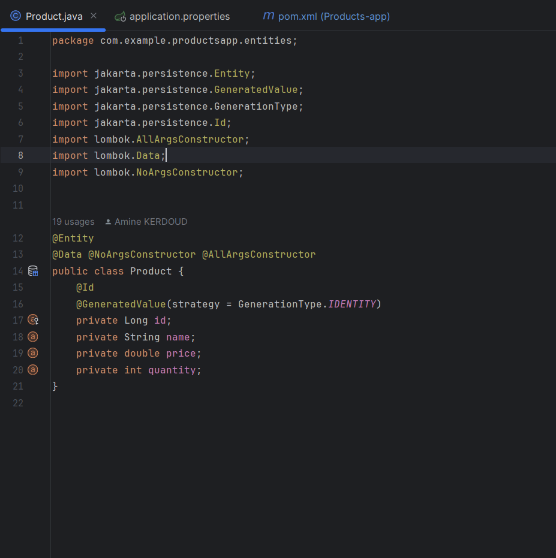

<h3>Compte rendu<h3>

<h4>1-Les dépendances JPA, H2, Spring Web, Lombock et Mysql</h4>

<h4>2-L'entité JPA Product</h4>

<h4>3-L'application.properties </h4>

<h4>4- L'interface JPA Repository basée sur Spring data</h4>

<h4>4-ProductApllication</h4>

<h4>5-La base de donnees Product </h4>

